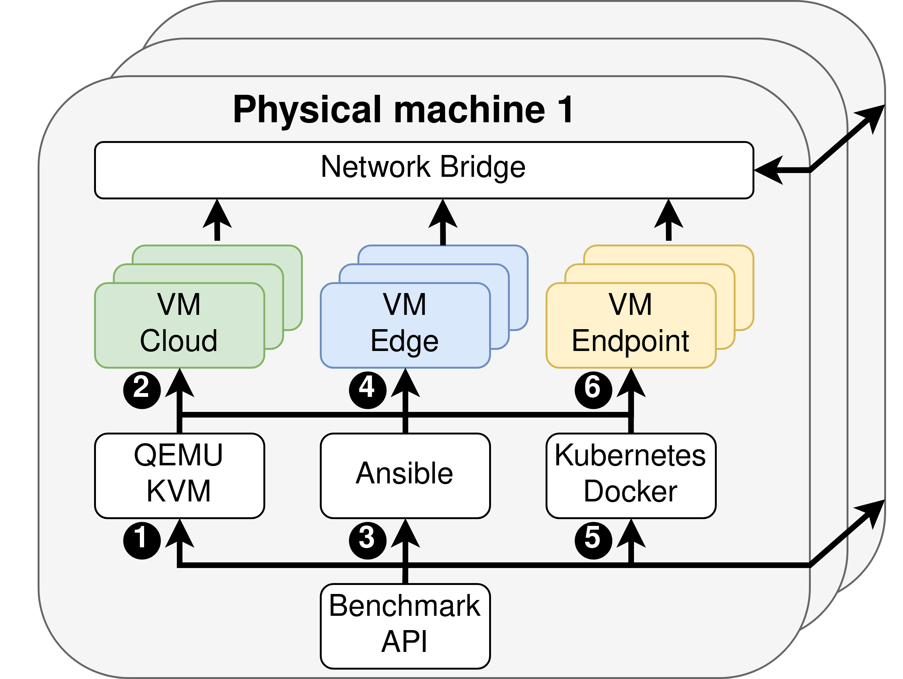

# Continuum
Continuum is a deployment and benchmarking framework for the edge-cloud compute continuum.
Continuum offers the following features:

1. Continuum automates the creation of a cluster of cloud, edge, and endpoint virtual machines to emulate a compute continuum environment.
2. Users can freely configure the specifications of the virtual machines and the network connecting them through a single configuration file.
3. Continuum automatically installs operating services, resource managers, and applications inside the emulated cluster based on the user's preference. Supported operating services include MQTT, resource managers include Kubernetes, KubeEdge, and OpenFaaS, and applications include machine learning.
4. Continuum can automatically benchmark the resource managers and applications installed in the emulated cluster, and report metrics and logs back to the user.
5. Continuum is easily extendable, allowing users to add support for more infrastructure providers, operating services, resource managers, and applications.

## Features
Continuum supports the following software:

1. **Infrastructure**: Virtual machine provisioning through QEMU/KVM on local bare-metal devices.
2. **Operating Services**: Continuum can set up an MQTT broker on edge device for lightweight communication to endpoint users.
3. **Resource Manager**: Continuum can deploy containerized applications via Docker and Containerd using the resource managers Kubernetes and KubeEdge. OpenFaaS is supported for deploying serverless functions.
4. **Applications and application back-ends**: Continuum supports any application that can be deployed on VMs, containers, or serverless functions. As an example, a machine learning application is included.

## How it works
Continuum has the following architecture:

<div align="center">
    
</div>
<br>

The execution flow consists of three phases, each having a configuration and execution step. These phases are **infrastructure deployment**, **software installation**, and **benchmarking**. Each phase is optional, i.e., the framework can be used for infrastructure deployment without any pre-installed software if so desired.

1. **Infrastructure configuration:** Libvirt configuration files for QEMU/KVM are created based on the user's preferences.
2. **Infrastructure execution:** The configuration files are executed, creating QEMU/KVM virtual machines connected through network bridges.
3. **Software configuration:** Ansible is configured for software installation based on the configured infrastructure.
4. **Software execution:** Ansible playbooks are executed, installing operating services and resource management software on each machine. This step includes setting up resource management clusters such as Kubernetes.
5. **Benchmark configuration** The benchmark is configured and prepared based on the user's preferences.
6. **Benchmark execution:** Applications (encapsulated in containers) are executed using resource managers running on the emulated infrastructure (Kubernetes, KubeEdge, etc.). Meanwhile, application- and system-level metrics are captured, processed, and presented to the user.

## Who Uses Continuum
The Continuum framework has been used for scientific research, leading to (i) publications, (ii) Bachelor and Master of Science projects and theses, (iii) has been the topic of multiple demos, and (iv) has been awarded artifact reproducibility badges. More information on the Continuum project and its contributors can be found [here](https://atlarge-research.com/continuum/).

### Citation
When using Continuum for research, please cite the work as follows:
```
@inproceedings{2023-jansen-continuum,
    author    = {Matthijs Jansen and
                 Linus Wagner and
                 Animesh Trivedi and
                 Alexandru Iosup},
    title     = {Continuum: Automate Infrastructure Deployment and Benchmarking in the Compute Continuum},
    booktitle = {Proceedings of the First FastContinuum Workshop, in conjuncrtion with ICPE, Coimbra, Portugal, April, 2023},
    year      = {2023},
    url       = {https://atlarge-research.com/pdfs/2023-fastcontinuum-continuum.pdf},
}
```
The presentation slides of this work can be found [here](https://atlarge-research.com/talks/2023-continuum-framework-fastcontinuum.html)

Other work on the Continuum framework includes:
```
@inproceedings{2023-jansen-refarch,
    author    = {Matthijs Jansen and
                 Auday Al-Duilamy and
                 Allesandro Vittorio Papadopoulos and
                 Animesh Trivedi and
                 Alexandru Iosup},
    title     = {The {SPEC-RG} Reference Architecture for the Compute Continuum},
    booktitle = {The 23rd IEEE/ACM International Symposium on Cluster, Cloud and Internet Computing, CCGRID 2023, Bangalore, India, May 1-4, 2023},
    year      = {2023},
    url       = {https://atlarge-research.com/pdfs/2023-ccgrid-refarch.pdf},
}
```
The presentation slides of this work can be found [here](https://atlarge-research.com/talks/pres-2022-compsys-mjansen.html) and [here](https://atlarge-research.com/talks/poster-2022-ictopen-mjansen.html).

### Student Work
The Continuum framework has been used by many students from the Vrije University Amsterdam:

**Bachelor Thesis**
* Daniel Berzak: Embedded Domain Specific Language: A Streamlined Approach for Framework Abstraction

**Master Thesis**
* Edgardo Reinoso Campos: Serverless Computing at the Edge in Precise Agriculture (ongoing)
* Antonios Sklavos: Exploring the Performance-Isolation Trade-off for Isolation Mechanisms (ongoing)
* Tim van Kemenade: A Comparison of Scheduling Algorithms in the Compute Continuum (ongoing)

**Student Research Projects**
* Felix Goosens: Edge Continuum Framework on an ARM Raspberry Pi Cluster
* David Freina et al: Serverless Computing in the Edge Continuum
* Andreas Frangos et al: Performance Variability and Resource Analysis in Serverless Applications

### Demo
The Continuum framework has been part of four classes with a demo, organized by the VU Amsterdam Bachelor and Master program Computer Science, as well as the Dutch Research School for high-quality research and education in computer systems and Imaging (ASCI).

for over 100 students and researchers in total. Specifically, it has been demoed in the following occasions:
* Distributed Systems (2021) - Part of the VU Amsterdam MSc program Computer Science
* ASCI A24 (2022) - A course in the Dutch Research School for high-quality research and education in computer systems and Imaging (ASCI)
* Distributed Systems (2022) - Part of the VU Amsterdam MSc program Computer Science
* ASCI A22 (2023) - A course in the Dutch Research School for high-quality research and education in computer systems and Imaging (ASCI)
* Computer Networks (2023) - Part of the VU Amsterdam BSc program Computer Science

<p>
  
  
</p>

### Artifact
The Continuum framework has been awarded the IEEE reproducibility badges for Open Research Objects (ORO) and Reusable/Research Objects Reviewed (ROR).
These badges have been awarded by independent reviewers as part of the CCGRID 2023 Artifact Track.
For more information on these badges, see [here](https://ccgrid2023.iisc.ac.in/call-for-artifacts/).
The code and instructions for this artifact are available on GitHub [here](https://github.com/atlarge-research/continuum/tree/CCGRID2023-Artifact-Evaluation). 

## Demo
Continuum supports multiple virtual machine infrastructure deployment platforms, most notably QEMU for execution on local hardware or Google Cloud for execution in the cloud.
In this demo, we present how to use Continuum using QEMU. 
If you want to use Google Cloud instead, which requires much fewer installation steps, please see the extensive README [here](https://github.com/atlarge-research/continuum/tree/CCGRID2023-Artifact-Evaluation).

This demo requires a single machine and a Linux operating system that supports QEMU/KVM and Libvirt.
We recommend running the demo on an Ubuntu 20.04 machine but have also tested on Ubuntu 22.04. 
If you don't have access to such a machine, see the Appendix for tips on how to install this in a VM.
We recommend installing the framework bare-metal for more reliable performance metrics.

The demo contains two parts:

1. Install the framework
2. Use the framework

In part one, we install the Continuum framework and use the framework in part 2.
The framework does support execution on multiple physical machines through a network bridge.
We leave this multi-machine execution out of this tutorial; consult the documentation for more information.
For more questions, open a GitHub Issue or mail m.s.jansen@vu.nl.

Software versions tested:

- QEMU 6.1.0
- Libvirt 6.0.0
- Docker 20.10.12
- Python 3.8.10
- Ansible 2.13.2

### Part 1: Install the framework
We start by installing all requirements for the Continuum framework.
We assume the operating system is Ubuntu 20.04, either natively or via a VM.
Ubuntu 22.04 should also work, but commands and packages might slightly differ.

```bash
# 1. Install the VM requirements
sudo apt update
sudo apt install qemu-kvm libvirt-daemon-system libvirt-clients bridge-utils

# 1.1. Give your user sufficient permissions
# After these steps, refresh you session to make the group addition take effect.
sudo adduser $USER libvirt
sudo adduser $USER kvm

# 1.2. Check if the installation was succesful
# If not, you may need to use `sudo systemctl enable --now libvirtd`
qemu-system-x86_64 --version
sudo systemctl status libvirtd

# 1.3. Force libvirt to use QEMU.
echo 'export LIBVIRT_DEFAULT_URI="qemu:///system"' >> ~/.bashrc
source ~/.bashrc

# 2. Install Docker (see Docker website for alternative instructions)
sudo apt-get install ca-certificates curl gnupg lsb-release

sudo mkdir -p /etc/apt/keyrings
curl -fsSL https://download.docker.com/linux/ubuntu/gpg | sudo gpg --dearmor -o /etc/apt/keyrings/docker.gpg

echo \
    "deb [arch=$(dpkg --print-architecture) signed-by=/etc/apt/keyrings/docker.gpg] \
    https://download.docker.com/linux/ubuntu $(lsb_release -cs) stable" | \
    sudo tee /etc/apt/sources.list.d/docker.list > /dev/null

sudo apt-get update
sudo apt-get install docker-ce docker-ce-cli containerd.io docker-compose-plugin

# After these steps, refresh you session to make the group addition take effect.
sudo groupadd docker
sudo usermod -aG docker $USER
sudo systemctl enable docker.service
sudo systemctl enable containerd.service
# Now refresh you SSH session by logging in / out

# Continuum creates a local docker registry using http
# Http support needs to be enabled
http_ip=$(hostname -I | awk '{print $1;}')
echo '{ "insecure-registries":["${http_ip}:5000"] }' | sudo tee -a /etc/docker/daemon.json
sudo systemctl restart docker

# 3. Install the Continuum framework
mkdir ~/.ssh
touch ~/.ssh/known_hosts

git clone https://github.com/atlarge-research/continuum.git
cd continuum

# 4. Install Python and some packages, including Ansible
sudo apt install python3 python3-pip
pip3 install -r requirements.txt

# 5. Edit the Ansible configuration as follows on Ubuntu 20.04:
# Under `[defaults]`, add `callback_enabled = profile_tasks`
# Under `[defaults]`, add `command_warnings = False`
# For Ubuntu 22.04, add just the following: callbacks_enabled=profile_tasks
sudo vim /etc/ansible/ansible.cfg

# 6. Setup up bridged networking on the machine
# First, delete any virtual bridges
virsh net-destroy default
virsh net-undefine default

# Check that no bridges exist anymore
virsh net-list --all

# Now create the new bridge itself
# Make a backup of the old network settings, then edit the new one
# Use `ip -a` to find the name of your network interface, for example, ens3
# and to find its IP, for example, 10.0.2.15
# Find the gateway address using `ip r` (the first IP on the first line)
# An example command could look like this:
sudo cp /etc/netplan/00-installer-config.yaml /etc/netplan/00-installer-config.yaml.bak

sudo su
cat > /etc/netplan/00-installer-config.yaml <<EOF
network:
    ethernets:
    ens3:
        dhcp4: false
        dhcp6: false
    bridges:
    br0:
        interfaces: [ens3]
        addresses: [10.0.2.15/16]
        gateway4: 10.0.2.2
        nameservers:
        addresses: [1.1.1.1, 8.8.8.8]
        search: []
        parameters:
        stp: true
        dhcp4: false
        dhcp6: false
    version: 2
EOF
exit

# Apply the changes
sudo netplan generate
sudo netplan apply

# Check if the bridge br0 was successfully created
# And check that the network interface, for example, ens3, doesn't have an IP listed anymore, but br0 does instead.
brctl show
ip a

# Enable IP forwarding
sudo su
cat >> /etc/sysctl.conf <<EOF
net.bridge.bridge-nf-call-ip6tables = 0
net.bridge.bridge-nf-call-iptables = 0
net.bridge.bridge-nf-call-arptables = 0
EOF
exit

# Then execute this command
sudo sysctl -p /etc/sysctl.conf
```

### Part 2: Use the framework
Continuum comes with many pre-made configuration files that can be used to deploy infrastructures and benchmark with Continuum. You can find these files in `/configuration`.
For example:
1. Go the the continuum framework: `cd continuum`
2. Check how the framework can be used: `python3 continuum.py --help`
3. We use a configuration that deploys 2 virtual machines, installs Kubernetes on them, and starts a third machine that emulates an IoT device that sends data periodically to the Kubernetes cluster for processing. The framework starts a processing application on the cluster, which processes the incoming data and sends the result back to the IoT device: `python3 continuum.py configuration/bench_cloud.cfg`.
4. If the program executes correctly, the results will be printed at the end, as well as the ssh commands needed to log into the created VMs.

Please explore what the Continuum framework can do, see `configuration/template.cfg` for a list of all configuration parameters. These include deploying infrastructure on Google Cloud, installing Prometheus and Grafana on VMs, or running serverless benchmarks. All components can be easily extended - open a GitHub Issue or send us a mail at m.s.jansen@vu.nl if you have any questions.

### Appendix
The Continuum framework is supposed to be run from an Ubuntu-like operating system.
The framework has been extensively tested on Ubuntu 20.04.
In this part, we show how to create an Ubuntu 20.04 VM that you can use to run Continuum in.
This example is supposed to be executed on a Linux machine.
```bash
# 1. Install the VM software QEMU, KVM, and Libvirt
sudo apt update 
sudo apt install qemu-kvm libvirt-daemon-system libvirt-clients bridge-utils

# Give your user sufficient permissions - this may require you to refresh your session
sudo adduser $USER libvirt
sudo adduser $USER kvm

# Exit your shell and open a new one for the permissions to take effect

# Check if the installation was succesful
# If not, you may need to use `sudo systemctl enable --now libvirtd`
qemu-system-x86_64 --version
sudo systemctl status libvirtd

# Download the Ubuntu 20.04 server image
wget https://releases.ubuntu.com/20.04.3/ubuntu-20.04.3-live-server-amd64.iso

# Create a QCOW disk as storage for your VM (at least 20 GB of disk space is advised)
qemu-img create -f qcow2 ubuntu.img 20G

#############
# Boot the VM
#############
# 1. On a system with a GUI
# - This will open a new window for the VM
# - Use at least 4 GB of RAM and 4 CPUs
sudo qemu-system-x86_64 -hda ubuntu.img --enable-kvm -m 8G -smp 4 -boot d -cdrom ubuntu-20.04.3-live-server-amd64.iso -cpu host -net nic -net user
#############
# 2. On a system without a GUI
sudo qemu-system-x86_64 -hda ubuntu.img --enable-kvm -m 8G -smp 4 -boot d -cdrom ubuntu-20.04.3-live-server-amd64.iso -cpu host -net nic -net user,hostfwd=tcp::7777-:22
# 2.1. Access the VM from an OS with GUI: You can now SSH in to machine
ssh -p 7777 ubuntu@127.0.0.1
# 2.2 On the VM, execute remmina so you can see the GUI of the VM on your machine
sudo apt install remmina
remmina
# 2.3 This should open the Remmina screen for you. Click on the + icon to create a new connection. Under protocol, select “VNC”, and then under server, add the VNC address displayed in the terminal where you started the VM (for example, 127.0.0.1:5900). Click save and connect to connect to the VM.
#############

# Finish the initialization of the VM
# Don't forget to install the open-SSH client during the installation
# Then, shut the VM down and re-launch
sudo qemu-system-x86_64 -hda ubuntu.img --enable-kvm -m 8G -smp 4 -cpu host -net nic -net user,hostfwd=tcp::7777-:22 --name ubuntu

# On a system with a GUI: The VM should open automatically
# On a system without a GUI: 
ssh [username]@localhost -p 7777
```

# Acknowledgment
This work is funded by NWO TOP OffSense (OCENW.KLEIN.209).


# Setting Up Scaphandre Integration in Continuum (QEMU Backend)

This README documents how to successfully integrate [Scaphandre](https://github.com/hubblo-org/scaphandre) energy monitoring into the [Continuum](https://github.com/atlarge-research/continuum) framework using QEMU with `virtiofsd`.

## Overview
By default, Continuum's QEMU provider does not include energy monitoring support via Scaphandre. This guide shows how to:

1. Modify Continuum to enable Scaphandre.
2. Enable `virtiofsd` support for directory sharing.
3. Automatically mount shared directories inside VMs.
4. Run Scaphandre Prometheus exporters per VM.

---

## ✅ Final Output
Once configured:
- Each VM shares a directory with the host via `virtiofs`.
- Scaphandre runs on the host, exporting metrics from each VM's directory.
- Metrics are available via Prometheus at:
  - `http://localhost:8080/cloud_controller_zsong`
  - `http://localhost:8081/cloud0_zsong`

---

## 1. Pre-requisites
- Ubuntu 20.04+ on host.
- `libvirt`, `qemu`, `virtiofsd` installed.
- Working Continuum environment.
- SSH keys configured for VMs.

---

## 2. Continuum Modifications

### A. `virtiofsd` toggle in config
Edit your config file (e.g., `configuration/qemu_kube_only.cfg`):
```ini
[infrastructure]
provider = qemu
virtiofsd = true
cloud_nodes = 2
...
```

### B. Patch: `generate.py`
In `infrastructure/qemu/generate.py`:

- Create shared folders automatically:
```python
if virtiofsd_enabled and name.startswith("cloud"):
    host_dir = f"/var/lib/libvirt/scaphandre/{name}"
    os.makedirs(host_dir, exist_ok=True)
```

- Inject into domain XML:
```python
<filesystem type='mount' accessmode='passthrough'>
  <driver type='virtiofs'/>
  <source dir='/var/lib/libvirt/scaphandre/{name}'/>
  <target dir='scaphandre'/>
</filesystem>
```

- Enable mounting via `cloud-init`:
```yaml
runcmd:
 - mkdir /var/scaphandre
 - mount -t virtiofs scaphandre /var/scaphandre
```

- In `additional_commands()` function:
```python
def additional_commands(commands):
    return "\n".join([" - " + cmd for cmd in commands])
```

### C. Optional: Reference Commit
If using a Git repo, you can reference a commit like:
```
Modified `generate.py`: [commit abc1234] Adds virtiofsd mount logic and runcmd config.
```

---

## 3. Host-Side Setup

### A. Permissions Fixes
```bash
sudo chown -R $USER:$USER /home/zsong/continuum
sudo chown -R $USER:$USER /mnt/sdc/zsong/.continuum
sudo chown -R $USER:$USER /var/lib/libvirt/scaphandre
```

### B. Launch VMs
```bash
python3 continuum.py configuration/qemu_kube_only.cfg
```

---

## 4. Running Scaphandre

### A. Start exporters per VM
```bash
sudo scaphandre prometheus --no-header --bind 0.0.0.0:8080 --fs /var/lib/libvirt/scaphandre/cloud_controller_zsong &
sudo scaphandre prometheus --no-header --bind 0.0.0.0:8081 --fs /var/lib/libvirt/scaphandre/cloud0_zsong &
```

### B. Verify
```bash
curl http://localhost:8080/metrics | head -n 10
curl http://localhost:8081/metrics | head -n 10
```

### C. Confirm Mounting
```bash
ssh cloud_controller_zsong@192.168.166.2 -i ~/.ssh/id_rsa_continuum
ls /var/scaphandre
```
You should see files added on the host.

---

## 5. Troubleshooting

- If `/var/scaphandre` is empty:
  - Ensure `/var/lib/libvirt/scaphandre/<vm_name>` has files.
  - Verify `mount | grep scaphandre` inside VM.
- If SSH fails:
  - Run `virsh list --all` to confirm VM state.
- If cloud-init commands are ignored:
  - Check `cloud-init-output.log` inside VM.

---

## 6. Cleanup
Kill all exporters:
```bash
sudo pkill -f scaphandre
```

---

## 7. Summary
This README walks through integrating Scaphandre with Continuum’s QEMU backend using virtiofsd for metric export. All modifications are lightweight and can be integrated via a simple config toggle and YAML injection.

If you have questions, feel free to open an issue or ping me!

## 8. 更新
6月16日，目前616版本实现了仅运行查询，并且同步更新了能耗图绘图以及折线图，以及现在可以指定query的重复次数，用repeat参数控制即可。
同时 目前还做了eventlog的生成

616是目前的最新版本
1. 可以控制查询次数
2. 只关注查询
3. 最后的log文件会直接转移到/home/zsong/continuum/eventloglocal下，加了一个appname名字在json文件里来确保后续分得清是哪个实验的事件log
4. 两款图都能正常记录
5. 实验设计完整，可按需跑，数据集早已生成完整，不包含任何生成数据或者建表过程，仅查询。

6.19更新内容
powerbar01.py是新的直接绘图逻辑，画折线图的，折线图的生成来自三次实验的平均值，同时包含按照时间阶段的划分（所以不用errorbar，到时候直接说三次平均值就行）
drawerrorbar.py是最新的画能耗图的逻辑，能得到能耗图的mean max min，有errorbar体现。

这两个脚本都很自动化，基本就是写实验名称就直接给你输出好了的，所以很方便。其中折线图只用到了一次的日志，日志不需要那么多次的了。drawerrorbar和日志无关，只是加了个errorbar去读取所有的三次的数据而已。
## 9. Todo
图全都可以干了，就差写故事了